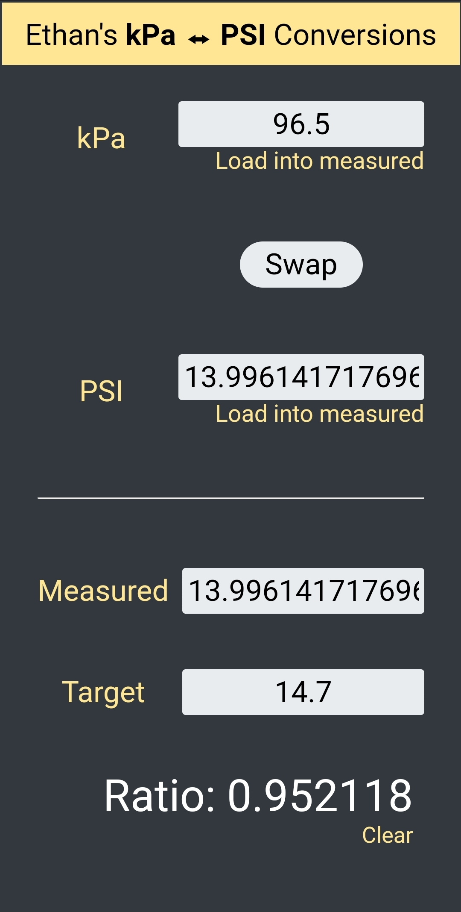

# KpA to PSI Conversion Application
This is a fully featured, responsive Android Studio application used to convert between KpA and PSI units.

The .apk file can be [downloaded here](https://github.com/SimeoW/kpa-to-psi/blob/master/compiled_app.apk), or generated by opening Android Studio and importing the project.
